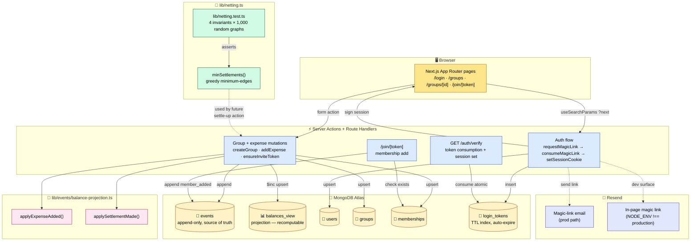

# Architecture

System diagram and data-contract spec for Pocket.

## End-to-end flow



## What each layer guarantees

**Client.** Server-rendered React 19 + App Router. Forms submit via Server Actions — no separate API layer. `useOptimistic` could be wired tomorrow for instant UI feedback.

**Edge (Server Actions + Route Handlers).** Auth-gated mutations call `requireSession()` first; throws redirect to `/login` if no cookie. All business logic lives here; the client just renders state.

**Database (MongoDB Atlas).** Six collections:

| Collection | Role | Indexes |
|---|---|---|
| `events` | Immutable, append-only source of truth | `(groupId, createdAt)`, unique sparse `clientEventId` |
| `balances_view` | Projection — recomputable from events | unique `(groupId, userId, currency)` |
| `users` | Auth-facing | unique `email` |
| `groups` | Group metadata | unique sparse `shareToken` |
| `memberships` | Many-to-many users ↔ groups | unique `(groupId, userId)` |
| `login_tokens` | Magic-link single-use | unique `token`, TTL `expiresAt` |

**Email (Resend).** Production path: real email delivery. Dev path: link surfaced in-browser. Production code is identical to dev; only the response shape differs gated on `NODE_ENV`.

**Algorithm.** Pure function. No DB dependency. Tested via property tests asserting four invariants.

**Projection.** Updates `balances_view` via `$inc` upserts. Idempotent at the DB level (re-applying the same delta is safe because `$inc` is commutative across the document).

## The data contract

`events.payload` is unstructured `Mixed` in Mongoose, but every type has an expected shape (validated by Zod at write-time in server actions). The shapes:

```typescript
// group_created
{
  name: string;
  baseCurrency: string;
  isTrip: boolean;
  creatorUserId: string;
}

// member_added
{
  userId: string;
  viaInvite?: boolean;
}

// expense_added
{
  expenseId: string;
  description: string;
  currency: string;
  fxRateToBase: number;       // 1.0 today; multi-currency scaffolding
  paidByUserId: string;
  splits: { userId: string; amount: number }[];
  totalAmount: number;
  expenseTimestamp: string;   // ISO date
  category?: string;          // for trip mode
}

// settlement_made
{
  settlementId: string;
  fromUserId: string;
  toUserId: string;
  amount: number;
  currency: string;
}
```

## Idempotency model

Three places duplicates can happen, three defences:

| Risk | Source | Defence |
|---|---|---|
| User double-clicks "Save expense" | Browser | `clientEventId` unique sparse index — DB drops the duplicate write |
| User double-clicks magic link in email | Browser | `findOneAndUpdate({consumedAt: null})` — atomic single-use |
| User visits invite link twice | Browser | `Membership.exists()` check before `Membership.create()` |

All three are at the DB layer. No application-level locking.

## What the architecture doesn't currently do (yet)

- **No SSE for real-time balance updates.** When User A adds an expense, User B sees the new balance only on next page refresh. The architecture supports SSE — adding a `/api/sse/[groupId]` route handler subscribed to event-emitter notifications is the next step.
- **No background projection rebuild.** If the projection drifts (e.g. via a half-failed mutation), it's currently rebuilt only manually. A scheduled job that replays the event log into `balances_view` would close this loop.
- **No FX-rate fetching.** `fxRateToBase` is captured in the event payload but always `1.0` today. A production deploy would fetch from a free API and cache.
